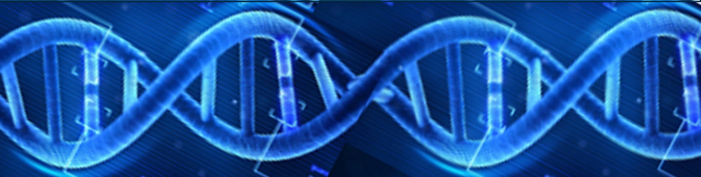

# University of Michigan Bioinformatics Core

[Michigan Medicine website](https://michmed.org/GqGzZ) &nbsp;&nbsp;&nbsp; | &nbsp;&nbsp;&nbsp; [Request a free consultation](https://docs.google.com/forms/d/e/1FAIpQLSepk7VqOl3xmBgkZybrl71VuQmKk3YmkgmpaBO4dD2hOtIh4w/viewform) &nbsp;&nbsp;&nbsp; | &nbsp;&nbsp;&nbsp; [Upcoming workshops](https://michmed.org/XYQwq) &nbsp;&nbsp;&nbsp; | &nbsp;&nbsp;&nbsp; bioinformatics@umich.edu

We help researchers identify and interpret patterns in RNA, DNA, and proteins by placing high-throughput data into a biologically meaningful context. 

For more information, check out the [UM Bioinformatics Core Wiki](https://github.com/umich-brcf-bioinf/.github/wiki/University-of-Michigan-Bioinformatics-Core).
